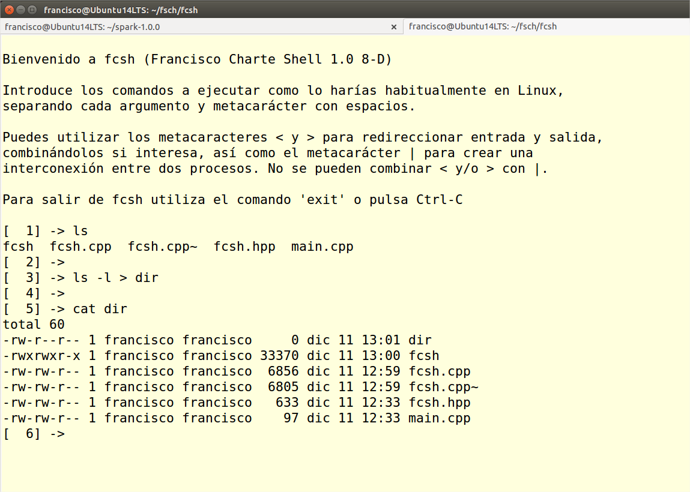

fcsh
====

A simple Linux shell to show the use of `fork()`, `execvp()`, pipes and input/output redirection.

Un sencillo shell de Linux que muestra cómo utilizar `fork()`, `execvp()`, tuberías y redirección de la entrada y salida.

Compilación/Compilation
=======================

Open a Linux terminal - Abre una terminal de Linux

Enter `g++ main.cpp fcsh.cpp -o fcsh` to compile the program - Escribe `g++ main.cpp fcsh.cpp -o fcsh` para compilar el programa

Enter `./fcsh` to run the program - Escribe `./fcsh` para ejecutar el programa

How to use the program/Cómo utilizar el programa
================================================

Enter the commands to run as you usually do in Linux,
using blank spaces to separate arguments and meta-characters-

You can use the `<` and `>` meta-characters to redirect the input and output,
even combining them if you want. The `|` meta-character can be used to create
an interconnection pipe between two processes. Mixing `<` and/or `>` with `|` is not allowed.

To exit `fcsh` enter the `exit`command or press `Ctrl-C`.

Introduce los comandos a ejecutar como lo harías habitualmente en Linux,
separando cada argumento y metacarácter con espacios.

Puedes utilizar los metacaracteres `<` y `>` para redireccionar entrada y salida
combinándolos si interesa, así como el metacarácter `|` para crear una
interconexión entre dos procesos. No se pueden combinar `<` y/o `>` con `|`.

Para salir de `fcsh` utiliza el comando `exit` o pulsa `Ctrl-C`
